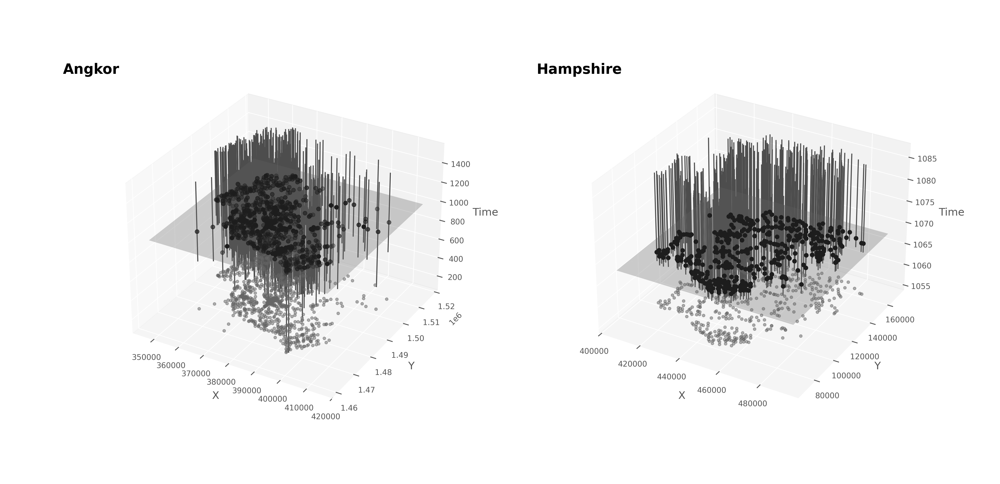
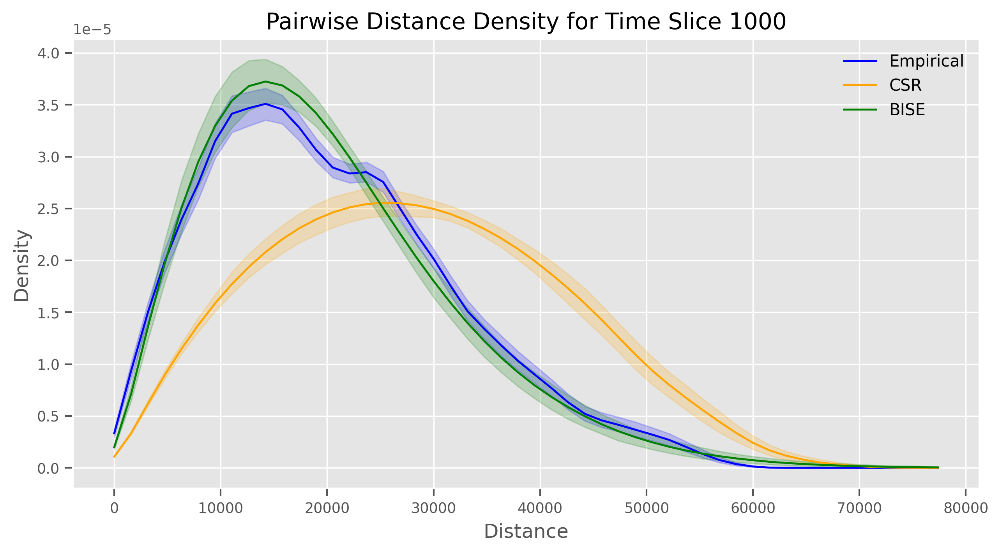
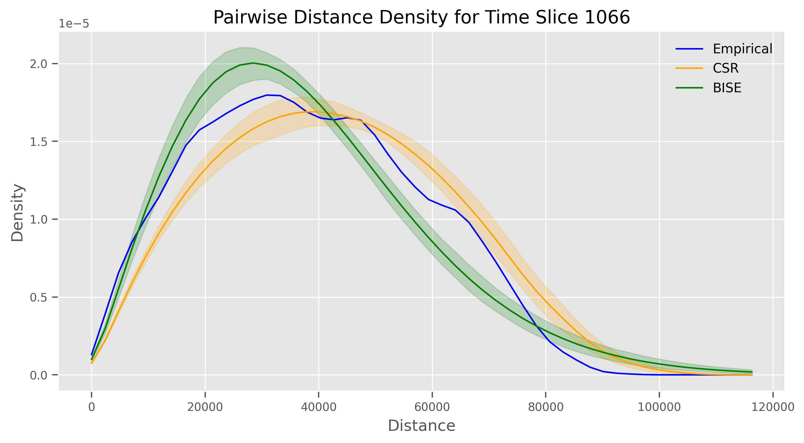
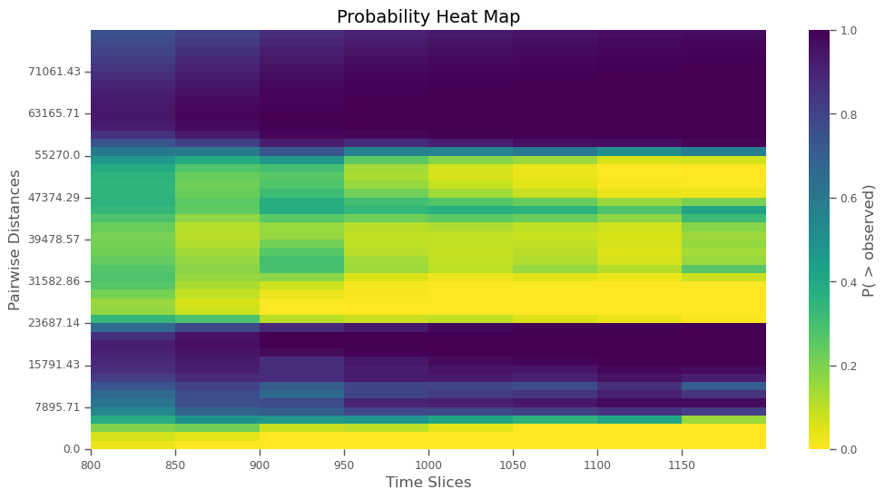
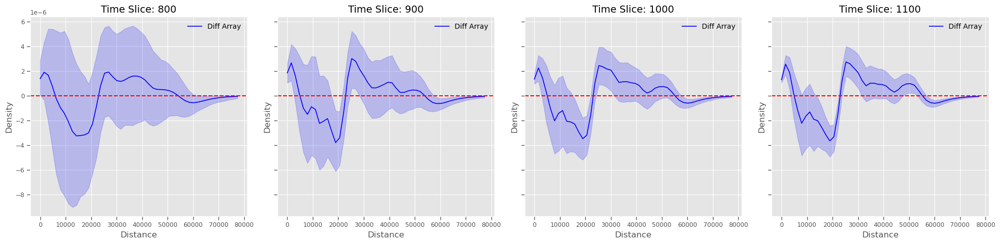
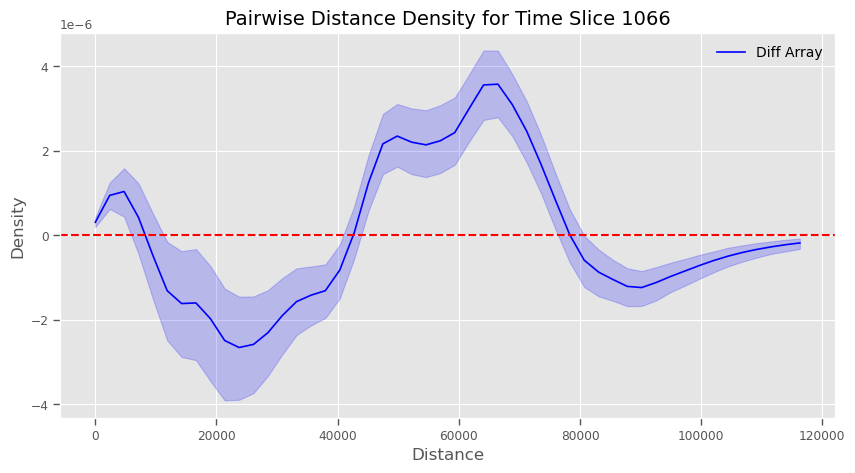
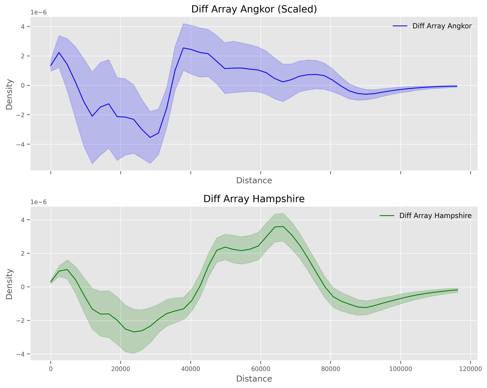

# Abstract
Low-density urbanism is a widely accepted but loosely defined label in archaeology. It broadly refers to settlements with urban traits---e.g., monuments, heterogeneous economies, and formal public spaces---but a spatial structure distinct from compact preindustrial cities. Low-density forms exhibit diffuse building patterns, integrated agro-urban land-use, gentle density gradients, and no formal urban-rural boundaries. The type-site for low-density urban settlement is Angkor, the eponymous political, economic, and religious centre of the Angkorian World located in modern-day Cambodia (c. 800-1500 CE). Frequently, Angkor is juxtaposed with pre-modern compact urbanism, represented by walled medieval European settlements, for example. But, the distinction lacks a rigorous quantitative backing. Using a newly developed Python package for temporally-aware spatial archaeological research called ChronoCluster, we employed pairwise distance density functions to directly compare Angkor's spatial structure to that of Anglo-Saxon Hampshire---politically centered on Winchester---as recorded in the Domesday survey (mid-11th century CE). Our analysis revealed striking spatial similarities between these seemingly distinct settlement systems. Specifically, both regions showed analogous multi-scalar clustering patterns, suggesting they may represent scaled versions of the same underlying urban-rural process rather than fundamentally different urban forms. This finding raises new questions about the mechanisms affecting urban form and challenges the prevailing dichotomy between low-density and compact premodern urbanism.

# Introduction
Urbanism is one of the most enduring and recurrent organizing principles in human history. For at least 5,500 years — and likely much longer — societies across the world have independently developed places that concentrate heterogeneous human activities, creating hubs of economic, political, and social interaction. Just as feudalism or capitalism are more than descriptions of political and economic conditions, urbanism is more than just a pattern of settlement or a general label for "city stuff" — it is a structuring force that reflects, shapes, and reinforces the social and economic relationships among people, affecting individual and collective behaviour. These places intensify and multiply human interaction leading to what some scholars have called "energized crowding" or "social reactors", both terms emphasizing the catalytic potential of urban spaces. Many of these settlements are easily recognizable in the archaeological record because they frequently resemble the familiar cities of today in terms of functions and traits, like posessing public spaces, formal street networks, and public (non-domestic) architecture. Many also have high building densities relative to their surroundings or other settlements and, in some parts of the world, walls that demarcate their boundaries. Others, however, challenge familiar models, with examples like the Classic Maya civic-ceremonial centres and the Angkor urban complex prompting some archaeologists to posit the existence of a distinct kind of premodern urbanism: low-density agrarian urbanism. 

Interdisciplinarity and advances in archaeology led to the proposition that premodern urbanism took dinstinct forms. Sociologists, geographers, and urban studies scholars have recognized that since the industrial era, cities have undergone cycles of de-densification, producing sprawling, mixed-use landscapes that blur the boundaries between urban and rural. Some have evolved into formally recognized, more-or-less continuous urban-industrial metropolitan regions, like the Greater Vancouver Regional District in Canada. Others have expanded into vast, interconnected urban-industrial-agricultural corridors, such as the Northeast Megalopolis in the United States. Similar patterns have been identified in parts of Asia, where "desakota"---a portmanteau combining the Indonesian _desa_ ("village") and _kota_ ("city")---describes agro-urban spaces that stretch continuously from dense urban cores out into their surrounding countrysides. While once thought to be a novel urban development of the post-industrial era, some archaeologists have argued that low-density forms existed in the past as well. Drawing on archaeological survey, mapping, and advances in remote sensing, archaeologists identified visual similarities between modern low-density urban complexes and ancient centres like Angkor or those of the Classic Maya. These observations led to the adoption of the terms like "low-density agrarian urbanism" in the archaeological literature used to describe sprawling, extensively cultivated mixed-use urban spaces. These low-density forms have been contrasted with the compact, nucleated settlement patterns of the past (e.g., walled medieval or bronze age Mesopotamian cities) characterized by a more definitive boundary separating the urban from the rural, something we refer to here as the "urbs-ex-rural" form.

If the apparent difference between these forms reflects real underlying differences, it suggests urbanism has historically taken multiple distinct trajectories. This would, in turn, imply different ways of structuring urban societies in the past and differences in both individual and collective urban behaviour. Additionally, the near-total collapse of these nominally low-density systems before the modern era raises critical questions about their long-term viability---questions that are particularly relevant today as cities worldwide continue to expand outward rather than upward. But the distinction has never been formally tested, leaving unresolved whether it reflects a real and meaningful difference. It remains unclear whether the archaeological record supports the existence of multiple, fundamentally distinct forms of urbanism, or if these apparent differences are better understood as variations on a shared underlying organizing principle. 

To evaluate this question, we present the first quantitative spatial comparison involving two key case studies: Ancient Angkor and Late Anglo-Saxon Hampshire. These settlement areas are often framed as belonging to fundamentally different urban categories — Angkor is the archetypal example of premodern low-density urbanism, and Hampshire from about 800 CE onward has largely been regarded as an example of conventional European settlement hierarchy of the Middle Ages centred on the urbs-ex-rural form with growing nucleated urban/market towns embedded in an agrarian landscape. Angkor, as we explained, serves as the type-site for premodern low-density agrarian urbanism. As the capital of the Khmer Empire between the 9th and 15th centuries CE, it has been widely interpreted as a decentralized, agrarian-based urban system, structured around an extensive network of temples, reservoirs, canals, and dispersed habitation zones. Over the past several decades, lidar surveys, satellite imagery, and ground-based mapping have revealed a vast, integrated settlement system spanning over 1,000 km², prompting many scholars to refer to it as the largest known premodern urban complex in the world. In contrast, Late Anglo-Saxon Hampshire, and particularly its urban core at the market town of Winchester, is generally considered an example of the more compact, nucleated urban tradition associated with medieval Europe, structured around a centralised market town embedded within a broader agrarian landscape and multi-tiered settlement hierarchy. While there is ongoing debate about the degree to which Late Anglo-Saxon and Early Norman England can be characterized as "fully urban" — especially given its relative lag behind continental Europe in urban growth and the importance of rural-urban networks beyond nucleated towns — Winchester by the time of the Domesday survey is widely accepted as a functioning urban center that was growing rapidly and had characteristics like a relatively dense "urban" population mostly contained within a circuit wall. 

We applied spacetime archaeological analysis to compare Angkor and Hampshire from the bottom up, using constituent-level functional analogues (see Table 1 for a summary). In the case of Angkor, we used a large database of community temple locations, which played a central role in religious life, agricultural organization, and local production. These temples were not merely places of worship but also hubs for economic redistribution, labour mobilization, royal administration, dispute resolution, and power negotiation, reflecting a deeply integrated system of state control and sacred authority as well as tensions between local elites and royalty. Their role in sustaining the Angkorian system has been widely documented, particularly through rice and labor contributions to central administration. Importantly, the temples and their distribution in space was germane for Angkor's categorization as a low-density agro-urban complex. For medieval Hampshire, we used the distribution of manorial estates, which formed the backbone of feudal economic and political organization. These estates, whether secular or church-owned, structured land tenure, resource extraction, and local governance. They supported agricultural production, military obligations, and judicial functions, acting as the key nodes in a hierarchical system linking lords, vassals, and monarchs. Like Angkor’s temples, manorial estates facilitated local economic redistribution and had obligations to central authority---whether through rents, dues, or military service. In both cases, we argue that the spatial patterning of these socioeconomic nodes provides a valid basis for comparing the broader urban-agricultural settlement systems and enough functional similarties exist with respect to social and economic roles to justify using them. Additionally, because the temple network has been used as primary evidence for the existence of low-density urbanism at Angkor, it must be central to any meaningful test of that model and, therefore, a suitable comparative case would have to include analgous data. By comparing these constituent-level functional elements, rather than aggregating settlements into whole 'cities' based on presumed boundaries, we also avoid the circular logic that would otherwise affirm the category we intend to evaluate and we can compare the two models of urban settlement directly without falling into circular reasoning (see FIG for a schematic of the comparison).

| **Comparative Aspect**         | **Manorial Estates (Medieval Europe)**                                             | **Community Temples (Angkor)**                                                            |
|--------------------------------|------------------------------------------------------------------------------------|-------------------------------------------------------------------------------------------|
| **Primary Function**           | Feudal economic and social organization                                            | Religious worship, community integration, agircultural production                         |
| **Key Contribution to Rulers** | Military service, rents, and dues                                                  | Rice and labor contributions                                                              |
| **Core Role**                  | Local production and redistribution; religious for church-owned estates            | Local production and redistribution, along with ritual and spiritual services             |
| **Connection to State**        | Feudal hierarchy linking lords and vassals                                         | Centralized administration under the king (degree of centralization varying through time) |
| **Symbolism**                  | Feudal order legitimised by divine right                                           | Sacred cosmology and royal divine mandate                                                 |
| **Autonomy**                   | Local judicial and administrative autonomy                                         | Centralized integration into royal networks                                               |
| **Economic Foundation**        | Mixed agriculture/livestock, markets                                               | Rice agriculture, craft production, some external trade                                   |
| **Infrastructure Supported**   | Castles, manorial courts, and local defense                                        | Temples, irrigation systems, and state projects                                           |
| **Cultural Context**           | Secular with some religious undertones; overtly religious for church-owned estates | Deeply rooted in Hindu-Buddhist traditions                                                |
| **Type of Obligation**         | Military and economic                                                              | Religious and agricultural                                                                |

To evaluate whether Angkor and Hampshire exhibit fundamentally different spatial structures, we compared the two cases using pairwise distance density (PDD) functions available in the `ChronoCluster` Python package. The `ChronoCluster` package was developed following a spacetime archaeology paradigm, explicitly designed to account for chronometric uncertainty. Each point in a `ChronoCluster` point set is assigned both spatial and temporal coordinates, with probability distributions reflecting temporal uncertainties. The package uses these distributions to calculate the probability that a given point existed in the relevant point-set at any given time, enabling temporally-weighted spatial statistics and the propagation of temporal uncertainty into spatial analyses. Using these tools, we produced PDD functions for comparison between the two settlement areas. Building a PDD involves computing all pairwise inter-point distances for a given point-set and then approximating the distribution of those distances with a density function. These distributions reveal multiscale structure in the point set, including clustering and repulsion, across inter-point distances. These patterns, in turn, provide insight into the underlying spatial logic of settlement organization. Importantly, `ChronoCluster` allowed us to propagate chronological uncertainties about the start and end times of the points in our point sets. This was most relevant for Angkor because, unlike the Domesday Book with well-known historical provenience, the Angkorian temple foundation dates have primarily been estimated using Bayesian modelling and machine learning approaches, which have temporal uncertainties associated with them that need to be considered and propagated along the analytical pipeline. We reasoned that if the PDDs in the two cases revealed different spatial structures, the finding would support the prevailing assumptions that Angkor represents a distinct kind of low-density premodern urbanism. If, however, the results revealed similar underlying spatial structures, the finding would challenge the idea that premodern low-density urbanism differed significantly from other forms, suggesting that these two seemingly distinct urban traditions represent variations on a common spatial logic.

# Methods
## Data Acquisition
Our analysis involved two sets of point data, both available online in open-access formats. The first dataset consisted of 1431 community temple locations in the Greater Angkor area, 105 of which have foundation dates estimated directly using epigraphy and/or art and architectural assessments. We acquired the point data from the supplementary material of Carleton et al. and followed the methods of that study to estimate posterior age estimates for the foundation dates of the 1326 undated temples. We then estimated a mean and standard deviation from the posterior samples for each modelled foundation date. These parameter estimates were subsequently used to define normal (Gaussian) distributions for the foundation dates of the temples. The directly dated temples, in contrast, were assigned Dirac delta densities (constant dates, effectively) for their start times with no uncertainty because they come from historical (epigraphic) data and/or art history assessments with no associated uncertainty estimates. Since no direct chronological information about temple or community abandonment are available for Angkor, we used Dirac delta densities to represent the end date distributions of all temples with the distributions centred on the historically defined political abandonment of Angkor at 1435 CE. The different temple foundation dates (both exmprical and modelled) along with the chronological uncertainty in those dates meant that we had sufficient information to evaluate change over time in the point pattern representing Angkor's urban trajectory.

The second dataset consisted of 435 manorial estates located in Anglo-Saxon Hampshire listed in the Domesday Book. Shortly after his victory over Harold II at the Battle of Hastings in 1066 CE, William I commissioned a survey of England's lands, aiming to strengthen Norman control and lay the foundations for his administrative reforms. The survey concluded in 1086 CE and results were compiled into the multi-volume Domesday Book. Entries in the book pertain to manorial estates---economic, social, and administrative units of land, organized under the feudal system and directly controlled by a lord or the Catholic Church. The contents of the book were translated and digitised in 2015 by scholars at the University of Hull and the National Archives, a process that included deducing the locations or manorial estates (down to 100m by 100m UK Ordinance Survey grid squares). We downloaded the raw data, including point locations, from the University of Hull website. We then isolated the points listed as within the county of Hampshire and cleaned a couple instances of points well outside the county having been duplicated and mislabelled as belonging to 'Hampshire'---this problem was first noticed because the maximum inter-point distances calculated during our analysis were initially far larger than expected and subsequent plotting in QGIS (https://qgis.org) revealed two 'Hampshire' points in other, distant counties that had identical coordinates to points with different (locally appropriate) county labels. Next, we used Dirac delta functions to represent the densities associated with start and end dates for each location and set the relevant parameters corresponding to the period between the Battle of Hastings in 1066 CE and the conclusion of the Domesday survey in 1086 CE. Effectively, these data constituted an historical snapshot of the spatial logic behind the point pattern representative of Anglo-Saxon Hampshire in place at the time of the conquest.

## Spacetime Modelling of PDDs with Chronological Uncertainty
Our primary focus was on estimating and comparing the PDD functions between the case studies based on point data representing hierarchically nested socioeconomic nodes embedded in managed agrarian landscapes. As we mentioned, PDD functions are densities that represent the relative frequency of pairwise distances in a given point set. They are a staple of spatial analysis in geography and have been used in archaeology for many decades. The function characterizes multiscalar (across all possible pairwise distances) structure in point process distributions, enabling direct comparisons between different point patterns. In general, estimating a PDD involves measuring inter-point distances for all possible point dyads and then representing the resulting distribution with a histogram or smooth density estimate. Here we used a standard Gaussian Kernel Density Estimate (KDE) for each set of $n$ inter-point distances, $(x_1, x_2, \ldots, x_n)$, which was given by:

$$
\hat{f}(x) = \frac{1}{n h \sqrt{2\pi}} \sum_{i=1}^{n} \exp \left( -\frac{(x - x_i)^2}{2h^2} \right)
$$

where:

- $\hat{f}(x)$ is the estimated probability density function at $x$,
- $n$ is the number of inter-point distances,
- $x_i$ are the observed inter-point distances,
- $h$ is the bandwidth parameter, controlling the degree of smoothing,
- The kernel function $K(u)$ is given by the standard Gaussian kernel:

$$
K(u) = \frac{1}{\sqrt{2\pi}} e^{- \frac{1}{2} u^2}
$$

which corresponds to the probability density function of a standard normal distribution.

The bandwidth parameter $h$ was automatically computed using Scott’s rule of thumb:

$$
h = \sigma n^{-1/5}
$$

where $\sigma$ is the sample standard deviation of the inter-point distances, and $n$ is the number of distances in the dataset. This method is a widely used heuristic for kernel density estimation, aiming to balance bias and variance in the density estimate.

To account for chronological uncertainty and potential change over time in archaeological point patterns, we we used a new python package called `ChronoCluster`. The package adopts a spacetime perspective for modelling archaeological data, which means that both space and time are considered dimensions that make up a spacetime volume---imagine a 3D cube containing a cloud of points where spatial coordinates are represented by the x- and y-axes while time is represented by a vertical z-axis. Each point in the volume is considered an abstract 'event' and has some temporal persistence represented by a vertical line connecting its start- and end-times. These lines are commonly called a "world lines" in physics and so we adopt the same terminology here. Each world line extends through the spacetime volume, allowing us to capture both spatial clustering and temporal persistence within a unified framework. A cornerstone of spacetime modelling with the `ChronoCluster` package is the calculation of "inclusion probabilities" given uncertain start- and end-date distributions for each point's world line. The package can calculate the probability that a given point existed---i.e., should be included in the point set---at any time (or "time slice") inside the spacetime volume. To perform the calculation, the package has to assign a random variable with a valid probability density function ($PDF(x)$), a valid cumulative probability density function ($CDF(x)$), and a valid survival function ($S(x)$) to the start- and end-coordinates of the point on the time-axis. Then, the probability that the point existed at any given time, $p(t)$, is the probability that the event's world line has started, $p_\alpha(t)$, multiplied by the probability that it has not yet ended, $\neg{p_\omega(t)}$. The former is given by the $CDF(t)$ of the start-date distribution while the latter is given by the survival function, $S(t)$, of the end-date distribution. 

With these inclusion probabilities, the `ChronoCluster` package can account for both temporality (change over time in the point pattern) and chronometric uncertainty in the start- and end-dates. One way it handles this is by creating ensembles of probable point sets for a given time by resampling the point set with replacement in accordance with the inclusion probabilities. This resampling amounts to a bootstrap and results in ensembles in which a given point's representation in the ensemble occurs with a frequency corresponding to its inclusion probability for the relevant time slice. Then, the KDE estimated as described above was produced for each probable point set, resulting in a distribution of smooth KDE-based PDDs for a given time slice and point set. It would also be possible to use the inclusion probabilities to weight the KDEs directly---and the Python package allows for this---but this would result in an averaged estimate that effectively marginalized the chronological uncertainty rather than reflecting it fully. Having a large ensemble of probable PDDs for a given time slice allowed us to use standard methods to represent the uncertainty, like quantile-based uncertainty envelops in PDD function plots, and to propagate it in further analyses.

The empirical PDDs were compared to two null models: a commonly used, uninformative model and a custom, more informative one. These null models allowed us to estimate whether features of a given PDD (modes or troughs) could be considered "significant" in the sense that they differed substantially from what would be expected under the given null. The first null model, _Complete Spatial Randomness_ (CSR), represents a standard assumption in point pattern analysis, while the second, which we term _Baseline Informed Spatial Expectation_ (BISE), incorporates large-scale spatial constraints to better isolate finer-scale structure within the observed point patterns.

CSR assumes that points are uniformly randomly distributed throughout a predefined study region. This model suffers from at least three disqualifying limitations. First, it is unrealistically agnostic about major geographic features that would distort or confine settlement options, leading to non-uniform distributions of points. Unless these large-scale effects are of specific interest, they tend to overshadow the finer, more socially and economically relevant structures. Second, humans, like other organisms, naturally cluster to some extent within any given study area, meaning that one should expect some large-scale clustering that would make any set of relevant points appear clumpy within an arbitrarily defined region. Third, the uniform CSR assumption forces the definition of a study area, which exacerbates edge effects and scaling issues. In this context, edge effects distort patterns by introducing too much empty space into the null model. A useful way to visualize this is to imagine a relatively uniform cloud of points with a tight bounding box around it, then expanding the box outward. The previously uniform distribution of points begins to appear clumpy within the newly expanded bounds, a manifestation of the "modifiable unit area" problem. Despite these limitations, we included a CSR null model for consistency and to highlight the power of our alternative approach.

The BISE model addresses some of CSR’s shortcomings by incorporating large-scale constraints that are not of primary interest. In our case, we sought to separate structure arising from (1) the general tendency of people to cluster within a larger study region and (2) very large-scale landscape constraints, such as the Tonle Sap shoreline in the case of Angkor or the Solent coastline in the case of Hampshire. To account for these influences, our BISE model used a statistical baseline that captured broad spatial clustering patterns, allowing the PDDs to reveal finer-scale structure within the observable cloud of points. Specifically, we modeled the expected spatial distribution as a 2D Gaussian distribution fitted to the empirical point cloud. This meant that the null model was centered on the observed data and had an overall shape and spread aligned with the real point distribution. A significant benefit of this approach is that it avoids the need to arbitrarily define a study area that could introduce or exacerbate edge effects and the modifiable unit area problem.

For both CSR and BISE, we generated simulated ensembles of point sets by drawing new coordinates for each point from the relevant probability distribution while preserving its chronological information. For CSR, new coordinates were sampled from a uniform distribution within a minimal rectangular bounding area encompassing all observed points. For BISE, the coordinates were sampled from the fitted 2D Gaussian distribution. In both cases, this approach produced simulated ensembles that maintained the temporal relationships and uncertainties of the original data while reflecting the spatial variability implied by each null model.

Then, to estimate the statistical significance we calculated the difference between the empirical PDDs and a corresponding null PDD based on simulated data from the relevant null model. This difference was a random variable reflecting chronological uncertainty in the chronometric data (start-/end-distributions) and spatial variability in the null model. For a given time slice and distance in the domain of the PDD, that random variable could be expected---with large enough bootstrap ensembles---to be well approximated by a normal distribution because it was the difference of two continuous density estimates. As a result, we could use that difference variable, $\Delta PDD$, for inference by assuming that its mean should be zero if there were no difference at a given time and distance between the empirical PDD ensemble and null PDD ensemble. The ensembles were contained in arrays of shape $(I, J, K)$, where $I =$ distance index, $J =$ time slice index, and $K =$ ensemble index. Then, the specific calculations for the "p-values" were as presented below, where `obs` was an observed array, `null` was the simulated null baseline array.

Firstly, we calculated the mean difference, $\mu_{\Delta_{ij}}$, between the observed and null PDD across the bootstrapped samples (axis=2) as follows,

$$
\mu_{\Delta_{ij}} = \frac{1}{N} \sum_{k=1}^{N} (\text{obs}_{ijk} - \text{null}_{ijk})
$$

Secondly, we calculated the standard deviation of the differences ($\sigma_{\Delta_{ij}}$) across the iterations (axis=2):

$$
\sigma_{\Delta_{ij}} = \sqrt{\frac{1}{N} \sum_{k=1}^{N} \left( (\text{obs}_{ijk} - \text{null}_{ijk}) - \mu_{\Delta_{ij}} \right)^2}
$$

Thirdly, we calculated the z-scores for each pair of distance and time slice:

$$
   z_{\Delta_{ij}} = \frac{\mu_{\Delta_{ij}}}{\sigma_{\Delta_{ij}}}
$$

And, lastly, we calculated the p-value using the CDF, $\Phi(\cdot)$, of the standard normal distribution:

$$
p = 1 - \Phi(z_{\Delta_{ij}})
$$

where low p-values imply positive differences, meaning that the empirical PDD is higher than the null baseline at a given distance. This means that $p \ll 0.5$ implied extreme positive differences under the null hypothesis and, so, we could interpret the resulting p-values in the usual way applying standard thresholds for significance in order to identify statistically significant structure (usually indicating clustering) in the empirical PDDs of each case study. Importantly, these tests accounted for both chronological uncertainty and spatial variation assumed under the relevant null model. It was, however, not necessary to adjust for multiple comparisons becasue we conducted only independent tests at each time-distance index to determine if the empirical function at that location differed from the sample of null PDD functions in the same place---no global test was performed that might be concerned with how many significant deviations occurred.

The data from Angkor had both chronological uncertainty and temporality, which we accounted for by producing a series of PDDs as described above for a series of time slices. Angkor's temples were founded at different times throughout the Angkorian period from c. 800 CE to at least c.1400 CE sometime after which construction slowed or halted and the area went into decline. The precise foundation and construction dates for most of the temples are not known, as we explained. Similarly, the precise abandonment dates are also unknown for the vast majority of temples and so we assigned an end date in line with scholarly convention and broad historical evidence that amounted to a _terminus ante quem_ ("time before which", or latest possible date) for most temples, even though the evidence is clear that some temples (e.g., Angkor Wat) remained occupied and active right up to the present day. Thus, the end date we selected for Angkor's temples simply reflects a scholarly norm and is effectively just the recent temporal bound of our study. Nevertheless, we were able to produce a series of PDDs for Angkor that varied and were less certain for earlier times in line with the varying known and modelled foundation dates and the associated modelling uncertainties. In order to make a meaningful comparison to Hampshire, we assessed the series for any evidence of significant change over time and plotted a selection of PDDs corresponding to a series of time slices. We also used a heatmap to represent and examine potential change over time in statistically significant deviations in the PDDs for the Angkor point set. The main objective was to determine which, if any, time slice(s) represented stable spatial logic in Angkor's urban growth trajectory that could be directly compared to the snapshot we had of Hampshire's spatial logic.

# Results
Our results revealed key similarities between the two case study regions, with settlement patterns shaped by both large-scale landscape constraints and inherent tendencies toward spatial clustering. These trends were evident in direct visualizations, statistically verified through PDD null model comparisons, and shown to be stable over time in the case of Angkor. The temporal stability at Angkor permitted the direct comparison between Angkor (1000 CE) and Hampshire (1066-86 CE) central to the present study. Importantly, that comparison revealed striking parallels in the spatial logic underlying their respective settlement structures.

Simply plotting the point sets from each region in 3D spacetime volumes suggested that each reflected similar large-scale patterns distorted by the local landscapes (see @fig-stv). In the case of Angkor, as shown in FIG, while there was variation in the point distribution over the first century or so resulting from the increase in temple construction, there was no obvious evidence of changes in the pattern after about 1000 CE. Additionally, we can see that there does appear to be a general tendency to overall, large scale clustering within the study region, creating the impression of a large, more-or-less oblong single major point cloud with a major axis running northwest to southeast along the shoreline of the Tonle Sap and bounded on the northeast by the Kulen Hills. Similar patterns were observed with the point data from Hampshire. The overall shape of the cloud of estate locations reflects the fact that the Hampshire is geographically bounded primarily on the south by the gently curving coastline. The otherwise fairly round cloud also reveals some visual clumpiness caused by the rolling to hilly terrain cut by wide river valleys and caused by the Isle of Wight to the south separated from the mainland by a narrow straight---overall less constrained than the settlement area of Angkor, making the entire point cloud more round.

{#fig-stv}

Comparing the $\Delta PDD$s with respect to different null models produced statistical support for the impression that large-scale landscape forces shaped the settlement systems, and demonstrated that the BISE null model was indeed better suited for resolving structure independent of those forces. As expected, using the CSR model (uniform random distribution) as the baseline led to the identification of statistically significant but low-information modes in the PDDs. In the case of Angkor, the CSR null highlighted a single broad mode corresponding to the width of the point cloud along its transverse axis. This structure most likely reflects the shape of the settlement area, compressed between the lake and the hills, with its longest axis running parallel to the lake shore, as predicted. The relationship between the null models and the empirical PDD for Angkor is presented in @fig-pddangkor, showing that the elongated Gaussian BISE distribution accounts for much of the overall point pattern structure and follows the empirical PDD more closely than the CSR model. This is because the BISE captures both the landscape’s shape and the natural tendency of humans to cluster into the most spatially efficient configuration that the environment, available resources, and social dynamcis allow. Subtracting the BISE from the empirical PDD revealed finer-scale socioeconomic and social structuring that could not be observed using the CSR null. Likewise, the BISE model improved spatial resolution in the PDD for Hampshire (figure @fig-pddhampshire), where it primarily captures natural gravity-like clustering in the settlement pattern. As expected, the CSR model overestimates the frequency of longer distances while underestimating shorter ones, failing to reflect the pull of human settlements toward denser cores. With fewer major geographic constraints, Hampshire's point cloud is rounder than Angkor’s, something the BISE captures but the CSR does not. In both cases, the BISE model isolates structure more relevant to societal, economic, and cultural differences in urbanism by controlling for broad clustering tendencies.

{#fig-pddangkor}

{#fig-pddhampshire}

Crucially, for present purposes, the PDD results for Angkor indicated enough temporal stability that we could compare it to the historical snapshot we had for Hampshire. Plotted as a heatmap (@fig-pddangkor_hm) and a series of time slices (@fig-dpddangkor_series), the PDDs indicate that the spatial logic underlying Angkor's structure was in place by 1000 CE and remained largely stable over the subsequent centuries. As @fig-pddangkor_hm shows, there is greater uncertainty before 1000 CE in terms of the structure of PDD (lower statistical significance and more blurring across the distance domain). This pattern is accounted for by the uncertain foundation dates (more blurring) and the process of urban growth/development characterised by relatively few early temples followed by a building boom throughout the 10th century (shifting bright regions in the heatmap). This boom in construction is consistent with historical records and the existing scholarly consensus. Interestingly, though, our results revealed remarkable stability in the overall PDD structure despite both the uncertainty and the growth process. This means that the spatial logic underlying urban growth at Angkor was likely set early on and persisted despite massive growth in population and the passage of several centuries. It also meant that we could use a time slice from at or after 1000 CE for direct comparison with Hampshire without needing to make further comparisons for each subsequent time slice.

{#fig-pddangkor_hm}

{#fig-dpddangkor_series}

Finally, the direct comparison between the PDDs from Angkor (1000 CE; @fig-dpddangkor_series) and Hampshire (1066-86 CE; @fig-dpdd_hampshire_series) revealed striking similarity. In each case, the function increases rapidly at the low-distance end of the domain and then declines, forming a first discrete mode. Then, the function declines into a large negative trough, before rebounding into the positive space and following a trajectory that creates a second, wider mode. Lastly, both functions come down again off the second mode, trailing to effectively zero for the rest of the function domain. This behaviour, somewhat like a damped oscilliation, indicates the presence of two statistically significant modes in the PDDs of both point sets. The first mode is much more distinct, implying a shorter-distance clustering where we would observe higher densities of points (estates in the case of Hampshire and temples at Angkor). The second mode, being much wider and more gradual, implies that there is some large-scale clustering beyond what would be expected under the BISE, perhaps a second order clustering of the more discrete, smaller-scale clusters responsible for the first mode. But, this second mode is much less distinct than the first, which suggests it would be harder to identify visually. Nevertheless, in both cases the bimodal, damped oscillator structure implies at least two scales of clustering are observable (at least statistically) in both cases.  

{#fig-dpdd_hampshire_series}

# Discussion
If Angkor and Hampshire represented fundamentally different types of urbanism---the former as low-density agro-urban and the latter as urbs-ex-rural---we would expect their spatial structure to be starkly divergent. Yet, we found some compelling similarities in the wave-like pattern of the PDDs, representing multi-scalar spatial clustering. In fact, the wave-like pattern appeared to us so strikingly similar between the two cases that we decided to look deeper. It seemed clear that one could stretch or compress either of the PDD functions along its x-axis and the main peaks and troughs of the waves would align. So, we did just that. We rescaled Angkor's PDD along its x-axis, which effectively means scaling all of the inter-point distances such that the longest distance across the settlement areas would be made equal---this would be analogous to expanding or contracting the diameter of one circle to match another. When we stretched Angkor’s PDD in this way, corresponding to a factor of around 2, its peaks and troughs align neatly with Hampshire’s (@fig-dpdd_scaled) — we confirmed the scale factor in a supplementary analysis (see Supplementary Information). This convergence suggests that rather than representing two distinct urban traditions, these settlements may be scaled manifestations of a shared underlying spatial logic. 

{#fig-dpdd_scaled}

To us, this alignment has a couple immediate and important implications. Firstly, the now widely accepted distinction between low-density and compact premodern urban settlement forms needs to be reconsidered. Since its introduction to the archaeological literature, this distinction has been applied beyond Angkor to Maya cities, to ancient Sri Lankan centers, and to Amazonian settlements that have only recently been mapped with lidar. In part, this expansion reflects an effort to broaden definitions of urbanism to include settlements that do not conform to outdated models while still exhibiting other traits associated with urbanism (e.g., formal-looking planning and layouts and monumental architecture). And, on one hand, our findings could be read as reinforcing the consensus that urbanism occurred in tropical settings and that it was not at all unique to places like Europe, North Africa, Southwest Asia, and East Asia. But, it also calls into question the need for the 'low-density' modifier, which may actually have, ironically, served to create exceptions rather than grow the urban category. More importantly, the label may be hindering a globally-relevant understanding of urban processes and forms. While it is clearly the case that cities, past and present, vary in terms of density (among cities and within individual cities), whether there are or have been categorically distinct urban trajectories matters tremendously for our understanding of urbanism and the way it arranges our societies, economies, relationships, landscapes, and cultures.

Secondly, if our findings are replicated, apparent differences in urban form should not be taken as evidence of types, but rather manifestations of an archetype. The dominant, top-down approach to defining premodern cities has relied on assumed categories — treating features such as walls and density estimates as definitive markers that can be used to distinguish types of urbanism. Yet, in doing so, it risks what might be called "begging the category". We see this as a form of circular reasoning in which cities are classified based on predefined expectations, and those classifications are then used to justify the very distinctions they presume. Instead of first identifying what actually structured life within a given settlement area and testing whether types emerge bottom-up, top-down approaches begin by assigning a category label, like 'compact' or 'low-density', drawing a boundary, and estimating population density based on those initial assumptions. And if, for example, the presence or absence of a wall both determines the label and establishes how spatial boundary for estimating densities is defined, then using the resulting density estimate as support for the label is circular — i.e., the system may be low-density merely because we have defined it that way, rather than because something about its constituents distinguishes it categorically from other systems. This is precisely the kind of reasoning the field has sought to move away from (e.g., Smith), particularly as it pertains to markers like walls as definitive indicators of city status, which is a hold-over from the Childean/Weberian and even ancient Greek and Roman view of "The City". For our study, we used an alternative, bottom-up approach. We identified at Angkor specific constituent structures — distribution maps of which have been used to visually classify it as low-density — examined their social and economic role, found socioeconomic and political analogues in another case (i.e., Hampshire’s manorial estates), and then compared the two directly. This comparative method from the bottom up reveals that rather than discrete urban types, these urban-rural landscapes exhibit variations of a shared underlying spatial and functional logic. If such structures emerge repeatedly across different regions and time periods, then the notion of low-density urbanism as a distinct category may not reflect actual urban diversity, but rather an artifact of circular classification.

Our findings — and the broader inferences they reveal — align with Settlement Scaling Theory (SST). SST was introduced by Bettencourt in a highly influential, paradigm-shifting paper. It suggests that human settlements, regardless of time or place, exhibit predictable relationships between population, spatial organization, and infrastructure density. Its mathematical predictions have been born out repeatedly, including in tests involving archaeological and historical cities. Geoffrey West, in his popular book "Scale", describes it as revealing the existence of a "Platonic city" that is scaled, as its population grows, in precise, quantitatively predictable ways — i.e., all cities are manifestations of an underlying archetype. The striking PDD convergence between Angkor and Hampshire supports this idea, albeit from a spatial structural perspective, rather than a population scaling one. We propose that urban settlement system clustering follows universal scaling principles, rather than being driven solely by historical contingencies or cultural traditions, giving rise to the observable variability in urban form across space, time, and culture.

While revealing, our study had two key limitations. First, we compared only two cases directly. It remains possible that other ancient cities currently identified as distinctive low-density types — such as Classic Maya centers or recently mapped Amazonian settlements — would continue to appear distinct even if compared to one or more urbs-ex-rural cases. However, our findings demonstrate at a minimum that Angkor, the original type site for the low-density model, is far more similar than previously recognized to a case that has not been labelled low-density. Importantly, as we argued, there are sufficient socioeconomic and political parallels with respect to the meaning of the individual points in both cases to justify a bottom-up direct comparison. This challenges the validity of the label itself, even though we cannot yet determine whether a distinctive low-density category exists, or existed at some point, globally.

Second, our study was constrained by the available data. For Hampshire, we primarily relied on the Domesday Survey, which provides only a snapshot of the urban-rural system as it existed in the Late Anglo-Saxon period. For Angkor, our chronology is based largely on modelled dates for temple construction and a single historically normative date for abandonment (the conventional endpoint of the Angkorian period in the mid-15th century). To fully capture the temporality of urban development, it would be ideal to have higher-resolution chronological data for Angkor and a more temporally variable point pattern for the comparator. It is possible, for instance, that the urban-rural system of Late Anglo-Saxon Hampshire changed significantly after the period we have data for. Still, after accounting for chronometric uncertainties — including modelled uncertainties for the Angkor point set — our results indicate that the spatial structures observed in both cases persisted for at least several centuries. Thus, at the point of comparison, the patterns we identified reflect real, long-standing urban forms rather than transient anomalies and that the distinctiveness of putative low-density urban systems should be reevaluated.

We identify two major avenues for future research. First, if our findings are replicated across cultures and time periods, the idea of a "Platonic city" will become an increasingly compelling description of human social, economic, and political organization in urban societies. As scaling research continues to accumulate evidence for universal urban trait scaling, further work on spatially explicit scaling could deepen discussions on what urbanism really is, how it emerges, and in what ways it varies through space and time. Once appropriate datasets have been compiled, our study could be repeated for point sets representing Classic Maya urbanism in Mesoamerica, Anuradhapura-period urbanism in Sri Lanka, and pre-Colonial Amazonian urbanism — all of which have been classified as low-density urban forms. Likewise, premodern centres thought to represent the compact form — e.g., other European medieval urban regions, Chinese walled cities, ancient Greek and Roman centres — should be analyzed to determine whether these, too, fall somewhere on a scaling continuum.

The source of the observed scaling differences also warrants further investigation. As we noted, we found that the scaling factor relating Angkor to Hampshire was about 2. This specific value may be significant. For instance, the ratio between the speed of an ambling horse and that of a walking human is also roughly 2. In medieval England, specific horse breeds were preferred for this gait, particularly among elites who needed to move efficiently between manorial estates. In contrast, horses were not widely used at Angkor and were generally uncommon in the tropics, where most premodern low-density cities have been identified. This raises the possibility that scaling differences may reflect fundamental factors such as modal transportation speeds, climate, agricultural land-use systems, and/or terrain. Testing this hypothesis across additional cases could reveal whether such environmental and infrastructural constraints systematically shape urban scaling patterns and would functionally link the "Platonic" form to the real variability we observe.

# Conclusion
Urbanism has long been a defining arena for human interaction and it will only become more central to shaping human life as the share of people living in cities increases. In order to understand urban processes and predict urban futures, we need to include the long history of urbanism from around the world, and we need to improve our understanding of the varibailty in urban forms and historical trajectories. Our study indicates that now-normative views about premodern urban processes and forms may be missing an underlying shared logic that shapes urbanism as a socioeconmic organizing principle. Our findings add a key, independent line of evidence to the growing body of research from scaling theory, suggesting that urbanism is not merely a historical contingency but a recurring, perhaps inevitable, outcome of collective human behavior at scale. As both a product and a driver of social, political, and economic organization, it is crucial that we refine our understanding of its true nature, structure, development, and variability. Doing so will not only deepen our understanding of human behavior but also improve our ability to craft sustainable policies that align with the fundamental processes shaping urban life.

